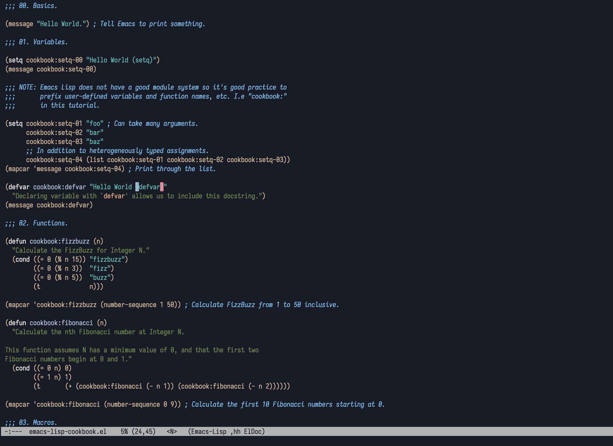

[](https://melpa.org/#/kuronami-theme)
# Kuronami (&#40658;&#27874;)
An Emacs theme with cool autumnal colors against a deep blue background. &#127809; &#10052; &#127754; <!-- emoji = autumn leaf, snowflake, wave -->

Inspired by Deeper Blue (GNU Emacs default), [Gruber Darker,](https://github.com/rexim/gruber-darker-theme) and [Naysayer.](https://github.com/nickav/naysayer-theme.el)



# Installation
## Requirements
You must have Emacs version 24.0 or later to use this theme as intended.

## Package Manager
Kuronami is readily available on [MELPA.](https://melpa.org/#/kuronami-theme) You can obtain a copy by configuring package.el or some alternative accordingly.

```emacs-lisp
(require 'package)
(add-to-list 'package-archives '("melpa" . "https://melpa.org/packages/") t)
```

## From Source
Download a copy of kuronami-theme.el by cloning this repository or copying the file as plain text. Then tell Emacs where to look for it on your system.

```emacs-lisp
(add-to-list 'custom-theme-load-path "~/path/to/directory/with/downloaded/copy")
(load-theme 'kuronami t)
```

# Commentary
This theme advocates the oxymoronic minimalist Emacs user and aims to keep a small scope. Many popular packages bundled with Emacs (Org and Magit) or provided by third parties do not have and will most likely continue to not have themed colors.
